# OwnVPN
## Целью учебной практики являлось установка и настройка собственного VPN сервера на основе WireGuard.
VPN (от англ. Virtual Private Network — виртуальная частная сеть) — это простое приложение, чьей основной задачей является защита данных пользователя при работе в Сети. VPN-сервисы перенаправляют пользовательский трафик через собственные приватные серверы, шифруя его в процессе, благодаря чему все данные, позволяющие идентифицировать пользователя надежно скрываются от посторонних.
VPN-соединение — это «туннель» между компьютером-сервером и компьютером пользователя. До попадания в него каждый узел шифрует данные.
После подключения к VPN система идентифицирует сеть и сравнивает указанный пароль с паролем в собственной базе данных.
После авторизации сервер позволяет выполнять определенные действия: читать почту, искать информацию в сети и т.д. Когда соединение установлено, трафик в зашифрованном виде передается между компьютером пользователя и сервером. Для работы в любой сети компьютеры имеют IP-адреса (IP — Internet Protocol).
Подключаясь к интернету напрямую через сеть провайдера интернет-услуг, компьютер или роутер пользователя получает IP-адрес из группы адресов, которая принадлежит провайдеру. Провайдер видит, когда и какой пользователь использовал IP-адрес и к каким серверам подключался. При использовании VPN все запросы к ресурсам идут от VPN-сервера, поэтому сайты видят его IP, а не клиента. Данные клиента также шифруются, а провайдер видит в трафике только обращение от компьютера пользователя к IP VPN-сервера.
WireGuard — это современный и бесплатный протокол для организации VPN, с открытыми исходным кодом. В 2020 году технология была внедрена в ядро Linux с номером 5.6. Раз она уже поддерживается в ядре Linux, то скоро появится и в ОС Android — уже разработаны ядра с поддержкой. WireGuard безопаснее, быстрее и проще других VPN. 
WireGuard использует самые быстрые и современные криптографические алгоритмы, признанные специалистами: Curve25519, ChaCha20, Poly1305, BLAKE2, SipHash24, HKDF. Такой узкий набор снижает гибкость шифрования, но повышает надёжность. Протокол был разработан с прицелом на меньшую сложность, что делает его устойчивым к атакам.
## Преимущества собственного VPN сервера:
-	Возможность гибкой настройки;
-	Наивысшая скорость соединения;
-	Отсутствие зависимости от сторонних сервисов;
При прохождении практики, качестве аппаратной части сервера было решено использовать арендованный сервер, который находится за пределами территории РФ. Сервер был арендован у интернет-сервиса https://veesp.com, предоставляющий доступ к виртуальным приватным серверам, расположенным в Риге. Данный сервис выделяется на фоне остальных тем, что предоставляет возможность арендовать виртуальный сервер, на котором развертывается Ubuntu с сразу установленной серверной частью WireGuard с доступом к веб-интерфейсу WGDashboard и администрированию пользователей. Это позволяет упростить установку и сократить настройку серверной части.
Настройка серверной части:
Для того, чтобы зайти в веб-интерфейс WGDashboard – необходимо перейти по адресу, соответствующему IP-адресу виртуального сервера, который можно узнать  в личном кабинете сервиса https://veesp.com в разделе Сервисы/Virtual Private Server (Рисунок 1).

 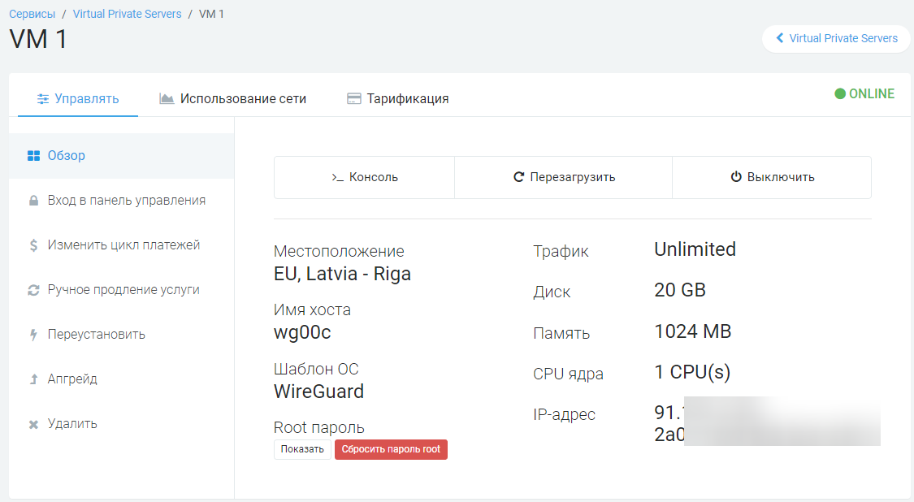

#### Рисунок 1. Сведения о сервер
Вход в веб-интерфейс (Рисунок 2) производится по логину и паролю. По умолчанию логин и пароль admin admin.

 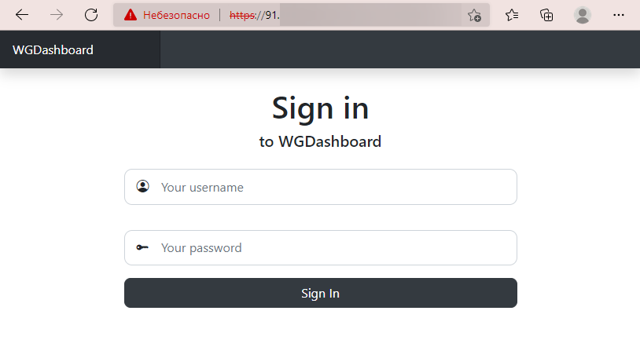

#### Рисунок 2. Вход в веб-интерфейс
Веб-интерфейс представляет из себя панели вкладок, предоставляющих основной функционал VPN сервера. По умолчанию будет создана одна конфигурация сервера, которая отображена на главной странице (Рисунок 3). Доступ к конфигурации для пользователей осуществляется по публичному ключу, поэтому для безопасности лучше не сообщать его третьим лицам.

 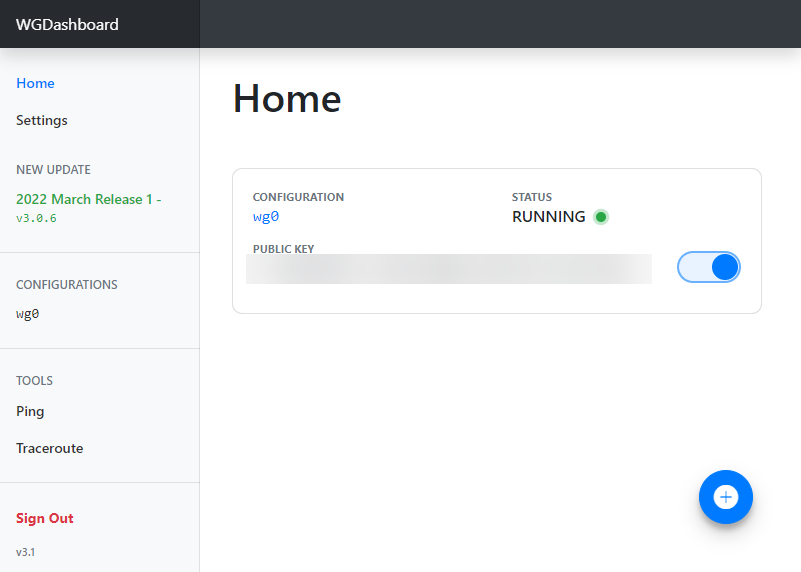

#### Рисунок 3. Главная страница веб-интерфейса
Первый делом стоит сменить стандартные логин и пароль, чтобы обеспечить безопасность администрирования сервера. Данная операция проводится во вкладке Settings (Рисунок 4).

 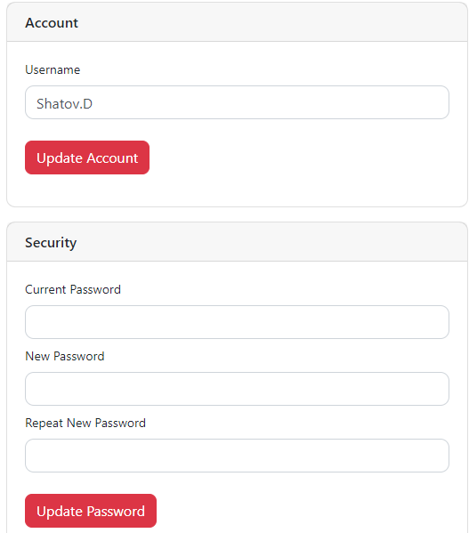

#### Рисунок 4. Меню Settings. Смена логина и пароля.
Для первоначальной настройки VPN необходимо создать конфигурацию, нажав на синюю кнопку «+» во вкладке Home (Рисунок 5).

 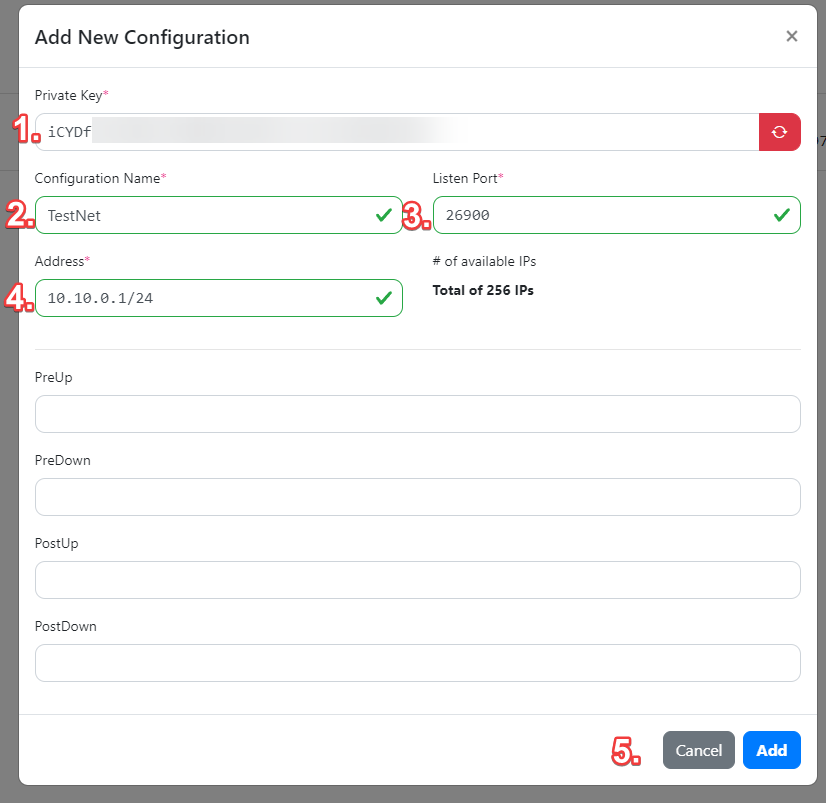

#### Рисунок 5. Создание конфигурации.
1.	Приватный ключ сети генерируется самостоятельно, либо можно изменить его вручную, зная его, можно подключиться к сети;
2.	Задаем имя конфигурации. В данном случае имя «TestNet»;
3.	Задаем порт, по которому будет идти трафик сети;
4.	Задаем внутренний IP-адрес и диапазон разрешенных адресов;
5.	Нажимаем кнопку «Add».
Конфигурация создана.
Количество конфигураций может быть больше одной, что позволит разделять трафик по разным портам. Это может быть удобно для анализа потраченного трафика и позволит разделять пользователей.
Для того, чтобы пользователи получили доступ к VPN – необходимо создать карточку пользователя в нашей конфигурации. Для этого переходим на страницу необходимой конфигурации и нажимаем на синюю кнопку «+» (Рисунок 6).

 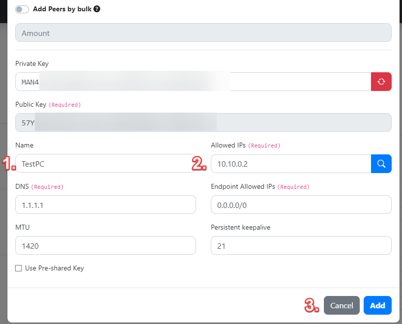

#### Рисунок 6. Создание карточки профиля (Peer).
Приватный и Публичный ключ генерируется автоматически, либо их можно поменять вручную.
1.	Указываем имя карточки (Peer), к VPN от WireGuard есть возможность подключать как ПК-пользователей, так и мобильных пользователей. Подключение по одной карточке Peer позволяет иметь защищённое соединение только с последнего подключенного пользователя. Для корректной работы 2х пользователей – необходимо создать 2 карточки, что позволит работать обоим пользователям одновременно.
2.	Выбираем адрес пользователя, который будет присвоен ему внутри системы, что позволит организовать локальный VPN-туннель между пользователями одной конфигурации.
3.	Нажимаем кнопку «Add».
Карточка профиля создана.
Настройка клиентской части:
Для доступа к нашему VPN серверу на стороне клиентских устройств необходимо установить клиентскую часть WireGuard. На официальном сайте WireGuard во вкладке Installation необходимо скачать и установить клиент WireGuard на интересующее нас устройство. Это может быть Windows, macOS, Android, iOS и большое семейство дистрибутивов Linux (Ubuntu, Debian, Fedora и прочие).
Рассмотрим настройку на примере Windows и Android.
Для доступа к VPN необходимо зайти в нашу конфигурацию TestNet и опустится до списка карточек (Рисунок 7).

 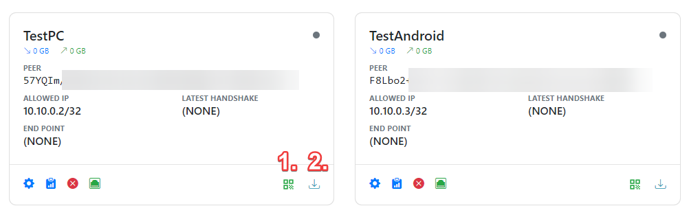

#### Рисунок 7. Список карточки профиля (Peers).
1.	Данная кнопка выведет на экран QR-код, который позволит осуществить быстрое подключение через мобильные устройства.
2.	Данная кнопка скачивает файл конфигурации сети, который необходим для настройки туннеля на Windows.
Windows:
Запускаем приложение WireGuard и следуем по пути «Добавить туннель/Импорт туннелей из файла». Выбираем скаченный нами файл разрешения .conf и загружаем его в программу. (Рисунок 8).

 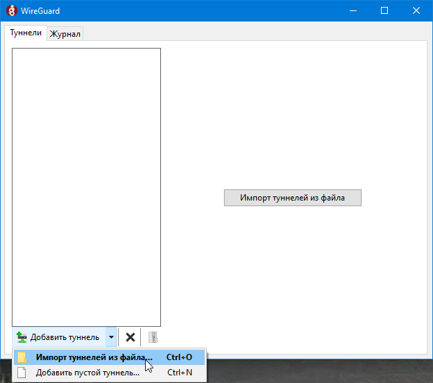

#### Рисунок 8. Импорт туннелей из файла в Windows.
Настройка Windows устройства завершена. Нажимаем кнопку «Подключить» Устройством можно пользоваться (Рисунок 9).

 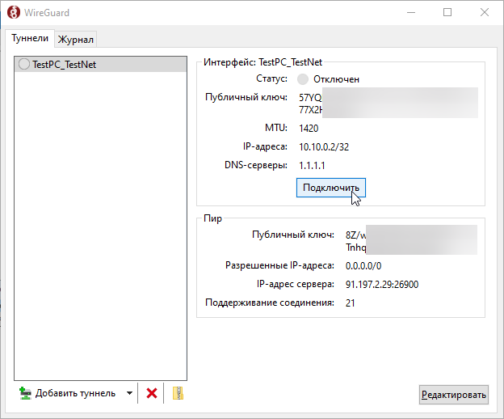

#### Рисунок 9. Подключение к VPN серверу.
Android:
Открывает приложение и в нижнем углу нажимает кнопку «+» (Рисунок 10) и из списка выбираем сканировать QR-Код (Рисунок 11), наводя на предварительно открытый QR-код карточки.

 

#### Рисунок 10. Приложение WireGuard на Android-устройстве.

 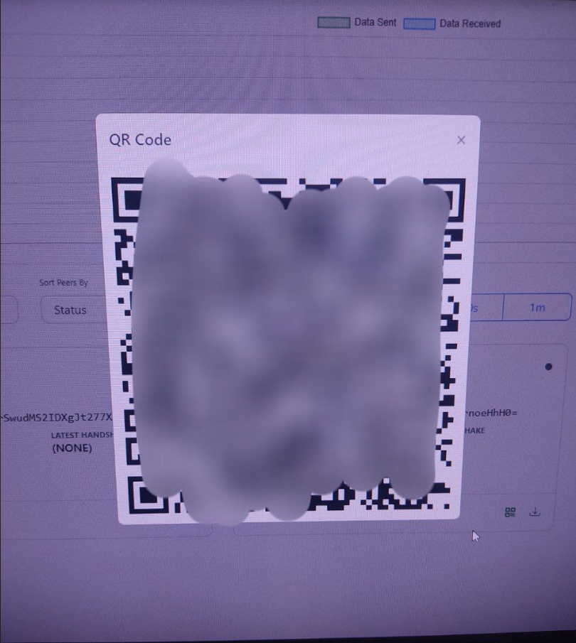

#### Рисунок 11. Сканирование QR-кода.
После чего приложение произведет подключение к серверу и сохранение настроек. Android устройство можно будет считать настроенным. При помощи ползунка-свитча можно включать и выключать VPN по собственному желанию (Рисунок 12).

 

#### Рисунок 12. Настроенное Android-устройство.
В конечном итоге, используя панель управления WGDashboard можно видеть исходящий и входящий трафик, количество подключенных пользователей и иметь доступ к карточкам пользователей, наблюдая персональный трафик, либо управлять статусом подключения. Был установлен и настроен свой VPN сервис на базе VireGuard, управление которым позволяет гибко настроить его лично под себя (Рисунок 13).

 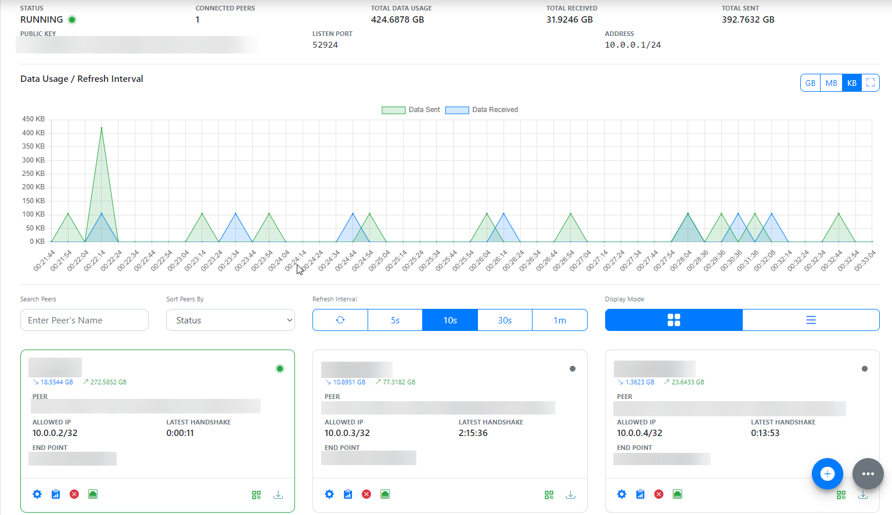

#### Рисунок 13. Мониторинг трафика на WGDashboard.
